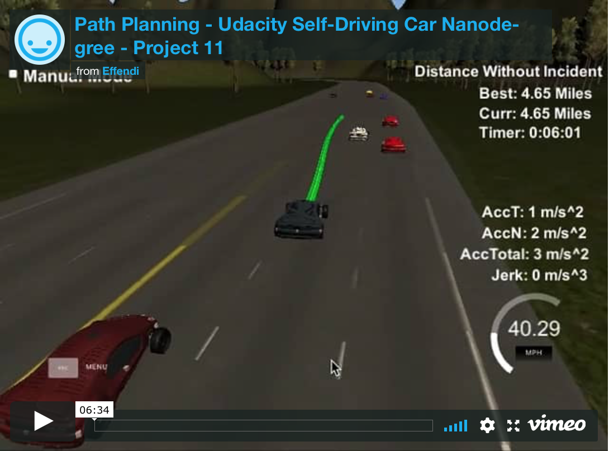
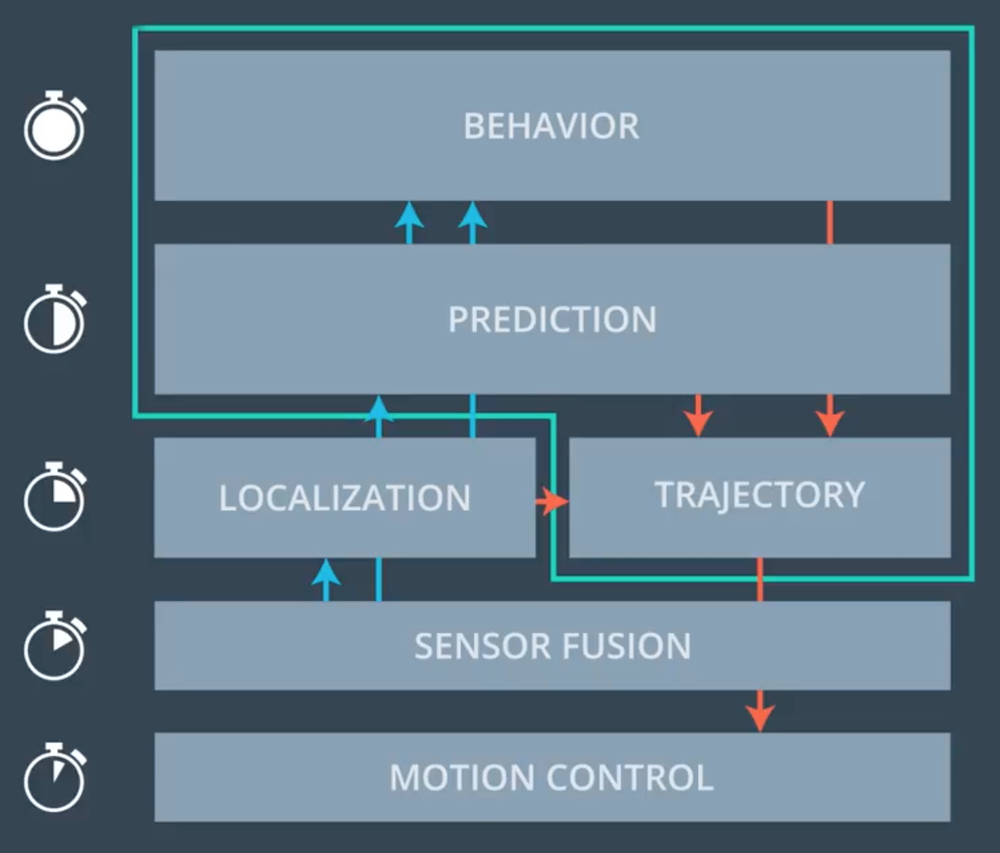
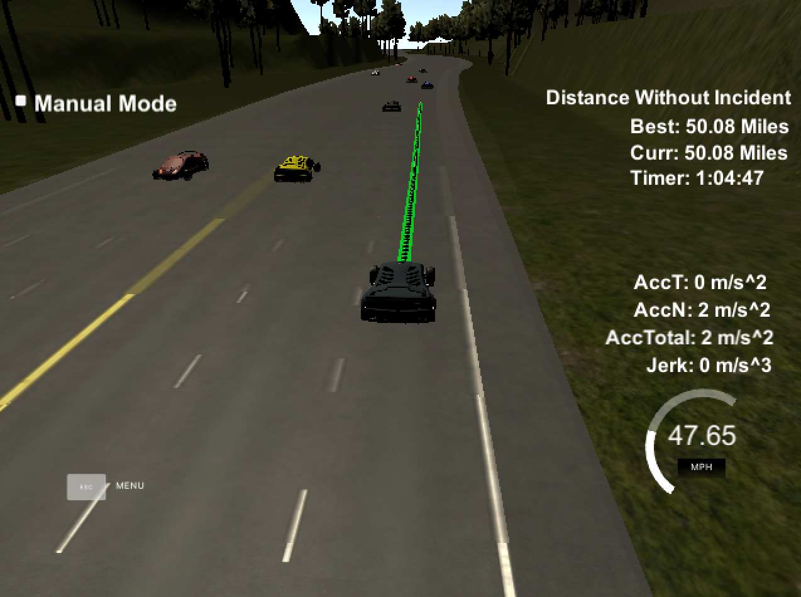

# **Path Planning Project**

**Udacity Self Driving Car Nanodegree - Project #11**

2018/02/06

## Overview

This project implements a **Path Planning** algorithm in C++ to **autonomously drive a simulated vehicle (ego car) around a freeway track** through various traffic conditions.

The vehicle must always stay below a **50 mph speed limit** and must also maintain **acceleration <10 m/s^2** and **jerk <10 m/s^3** while **staying in the lanes** to prevent violation incidents that reset the distance and time counters.  The vehicle drives by moving to each (x,y) coordinate in the path every 20 ms without any filtering or vehicle dynamics.  The path planner must continuously provide a new path that is seamlessly connected to the previous path despite possible communication delays with the simulator.

The other vehicles vary their speed at +/- 10 mph from the 50 mph limit and may also change lanes, swerve, or do hard braking so **the path planner must be able to control speed and change lanes safely and smoothly to avoid collisions while trying to keep close to the 50 mph target limit.**

#### Video of project result:

## Project Reflection

Path planning is one of the most challenging parts of a self-driving car because it incorporates the high-level "brains" of the driving behavior.  This project integrates the following parts:

1. **Sensor Fusion** - Gather and process data about the vehicle's state and the surrounding vehicles
2. **Prediction** - Estimate where the surrounding vehicles will be over a finite time horizon
3. **Behavior Planning** - Decide the vehicle's driving intent and target operating conditions
4. **Trajectory Generation** - Make a path trajectory that achieves the behavior target safely
5. **Control** - Actuate the vehicle to follow the planned path trajectory

*Image source: Udacity Behavioral Planning lesson video*

#### 1. Sensor Fusion

In this project, the simulator provides some sensor data already processed for localization of the vehicle's global (x,y) position, the surrounding vehicles' global (x,y) positions and (vx,vy) velocities, and the previous path coordinates that have not been driven yet.  A map of sparse waypoints around the freeway track is also provided.  However, some **additional processing was needed** to prepare the data for path planning.

For this section, the following steps were implemented:

1. Process previous ego car path to determine where in the path the ego car is now
2. Use received (x,y) to update the ego car's state (convert to Frenet with custom functions)
3. Process detected cars within sensor range (to realistically limit available info)
4. Group detected car ID's by lane # for easier lookups

In order to simplify the coordinate system, all (x,y) coordinates are converted to **[Frenet](https://en.wikipedia.org/wiki/Frenet–Serret_formulas) (s,d) coordinates**, where **s** is the tangential distance along the road centerline and **d** is the normal (lateral) distance from the road centerline.  The original provided Frenet conversion functions were not accurate enough to generate smooth paths from direct (s,d)->(x,y) conversion, so a **custom Frenet conversion implementation** was made instead to avoid the need for spline interpolation of the path trajectory.  Splines were only used to interpolate the sparse map waypoints to a higher resolution.

The Frenet (s,d) coordinates were then used to estimate each vehicle's state (s, s_dot, s_dotdot, d, d_dot, d_dotdot) and lane position.

#### 2. Prediction

Once the detected surrounding vehicles' states are known, their estimated paths can be predicted over a finite time horizon (~1.5 sec) with some probabilities that account for the prediction uncertainty.  These **predictions are needed to be able to choose a trajectory that considers the possible risk of collision with these surrounding vehicles at some future point in the path**.

For this section, the following step was implemented:

1. Predict detected car trajectories over fixed time horizon for each possible behavior with associated probabilities

Some estimations were made about the probabilities of a surrounding vehicle keeping it's lane or changing lanes and at what speed it would maintain based on the other vehicles around it.  The surrounding vehicle's start/end state acceleration for the predicted time horizon was assumed to be zero.

#### 3. Behavior Planning

The behavior planning section performs the highest level decision making to choose a target behavior including target lane, target intent, target speed, and target time to achieve them.  The surrounding vehicles are considered when setting these targets, but possible collisions are not factored in so that the ideal overall target is not restricted.

For this section, the following steps were implemented:

1. Decide the **target lane** to be in based on a **cost function**
2. Decide **target intent** based on the target lane using a **Finite State Machine** with the following states:
*Keep Lane, Plan Lane Change Left, Plan Lane Change Right, Lane Change Left, Lane Change Right*
3. Decide **target time** for the planned path
4. Decide **target speed** for the end of the planned path

The target lane is chosen using a cost function that considers:

* Cost by distance to car ahead
* Cost by speed of car ahead
* Cost of fast car coming up from close behind
* Cost of changing lanes
* Cost of frequent lane changes

The target speed is limited to follow the car ahead and also considers the speed of a car in the target lane when changing lanes.

The target path time is usually a fixed value of 2.5 sec for smooth transitions, but can be shortened to 1.5 sec for faster response if the risk of collision is high.

#### 4. Trajectory Generation

Once a target behavior is decided, a final trajectory needs to be generated to achieve it while avoiding possible collisions with surrounding vehicles.

For this section, the following steps were implemented:

1. Keep some of the previous path as a buffer to start the next trajectory
2. **Generate a new ego car path trajectory** to achieve the target behavior
3. Append the new trajectory after the previous path buffer

Due to communication latency between the simulator and path planner, a portion of the previous path (~0.5 sec) is kept as a buffer and the new path is appended after that to keep smooth continuous transitions.

Starting from the end of the previous path buffer, the **new trajectory is generated by solving for a [Jerk Minimizing Trajectory (JMT)](http://courses.shadmehrlab.org/Shortcourse/minimumjerk.pdf) set of polynomial coefficients (5th order)** that connect the start state to the target end state.  This is done for Frenet s and d separately, and the corresponding state variables are (s, s_dot, s_dotdot) and (d, d_dot, d_dotdot).

To **decide the best trajectory that also avoids collisions** with surrounding vehicles, the following steps were implemented:

1. Generate **multiple trajectories with random variations** in target speed and time
2. Limit the trajectories' max speed and accel in (x,y) to stay within **feasibility limits**
3. **Assign a cost to each trajectory** based on **accumulated collision risk** from the predicted paths of detected vehicles, and the **amount of deviation** from the base target
4. Add a **backup trajectory** to keep current lane and slightly slow down in case all other trajs have risk cost above an allowable threshold
5. Select the **final trajectory with the lowest cost**

The trajectory in Frenet (s,d) coordinates is then **converted directly to (x,y) coordinates** as the final trajectory with the custom conversion functions.

#### 5. Control

The simulator follows the path by simply moving the vehicle to each coordinate every 20 ms, so **no actual vehicle controller is needed in this project**.  In a real vehicle, a PID or MPC controller could use the final trajectory to decide vehicle control inputs (throttle, steering, etc) to actuate it but the purpose of this project is to focus on the path planning portion so the raw path trajectory coordinates are the final output sent to the simulator.

For this section, the following steps were implemented:

1. Pack and send JSON path trajectory coordinates

## Endurance Test Result

As an additional test, the path planner was able to complete driving **50 miles in 1 hour 4 minutes (ave 47 mph)** keeping speed close to the 50 mph target limit without any violation incidents, shown in the image below.

## Key Files

| File                         | Description                                                                                                                       |
|:----------------------------:|:---------------------------------------------------------------------------------------------------------------------------------:|
| /src/main.cpp                | Source code for **main loop** that handles **uWebSockets communication to simulator** and implements the **overall path planner** |
| /src/path_common.cpp, .hpp   | Source code for **common parameters** and **helper functions**, such as the **custom Frenet conversion functions**                |
| /src/vehicle.cpp, .hpp       | Source code for **Vehicle** base class, **EgoVehicle** and **DetectedVehicle** subclasses, and general vehicle functions          |
| /src/sensor_fusion.cpp, .hpp | Source code for **Sensor Fusion** algorithm that processes the provided sensor data to update the vehicles' states                |
| /src/prediction.cpp, .hpp    | Source code for **Prediction** algorithm that estimates the future possible paths of the surrounding vehicles                     |
| /src/behavior.cpp, .hpp      | Source code for **Behavior Planning** algorithm that chooses a target driving behavior                                            |
| /src/trajectory.cpp, .hpp    | Source code for **Trajectory Generation** algorithm that makes a path trajectory to achieve the target behavior                   |
| /src/spline.h                | Source code for [Cubic Spline interpolation in C++](http://kluge.in-chemnitz.de/opensource/spline/), used to interpolate the sparse map waypoints to a higher resolution |
| /data/highway_map.csv        | Map of sparse waypoints along the centerline of the road                                                                          |
| /build/path_planning         | Output **executable program binary**                                                                                              |
| install-mac.sh               | Script for Mac to install uWebSocketIO required to interface with simulator                                                       |
| install-ubuntu.sh            | Script for Linux to install uWebSocketIO required to interface with simulator                                                     |

The original Udacity project repository is [here](https://github.com/udacity/CarND-Path-Planning-Project).

## How to Build and Run Code

This project involves the Udacity Term 3 Simulator which can be downloaded [here](https://github.com/udacity/self-driving-car-sim/releases/tag/T3_v1.2)

This repository includes two scripts (**install-mac.sh** and **install-ubuntu.sh**) that can be used to set up and install [uWebSocketIO](https://github.com/uWebSockets/uWebSockets) for either Linux or Mac systems.

Once the install for uWebSocketIO is complete, the main program can be built and run by doing the following from the project top directory.

1. mkdir build
2. cd build
3. cmake ..
4. make
5. ./path_planning

If using Xcode to build, run the following commands:

1. mkdir xbuild
2. cd xbuild
3. cmake -G "Xcode" ..
4. Open "Path_Planning.xcodeproj" in Xcode and build
5. cd Debug
6. ./path_planning

## Other Important Dependencies

* cmake >= 3.5
  * All OSes: [click here for installation instructions](https://cmake.org/install/)

* make >= 4.1 (Linux, Mac), 3.81 (Windows)
  * Linux: make is installed by default on most Linux distros
  * Mac: [install Xcode command line tools to get make](https://developer.apple.com/xcode/features/)
  * Windows: [Click here for installation instructions](http://gnuwin32.sourceforge.net/packages/make.htm)

* gcc/g++ >= 5.4
  * Linux: gcc / g++ is installed by default on most Linux distros
  * Mac: same deal as make - [install Xcode command line tools](https://developer.apple.com/xcode/features/)
  * Windows: recommend using [MinGW](http://www.mingw.org/)

* uWebSockets (see above)

* [Eigen](http://eigen.tuxfamily.org/index.php?title=Main_Page). This is already part of the repo so you shouldn't have to worry about it.

* [Cubic Spline interpolation in C++](http://kluge.in-chemnitz.de/opensource/spline/)

## Communication protocol between uWebSocketIO and Simulator

**INPUT to main.cpp**: values provided by the simulator to the C++ program

* ["x"] The car's x position in map coordinates
* ["y"] The car's y position in map coordinates
* ["previous_path_x"] The previous list of x points previously given to the simulator
* ["previous_path_y"] The previous list of y points previously given to the simulator
* ["sensor_fusion"] A 2d vector of cars and then that car's sensed data [car's unique ID, car's x position in map coordinates, car's y position in map coordinates, car's x velocity in m/s, car's y velocity in m/s, *car's s position in frenet coordinates* **(NOT USED)**, *car's d position in frenet coordinates* **(NOT USED)**].
* *["s"] The car's s position in frenet coordinates* **(NOT USED)**
* *["d"] The car's d position in frenet coordinates* **(NOT USED)**
* *["yaw"] The car's yaw angle in the map* **(NOT USED)**
* *["speed"] The car's speed in MPH* **(NOT USED)**
* *["end_path_s"] The previous list's last point's frenet s value* **(NOT USED)**
* *["end_path_d"] The previous list's last point's frenet d value* **(NOT USED)**

**OUTPUT from main.cpp**: values provided by the C++ program to the simulator

* ["next_x"] Path x coordinates for the car to drive along
* ["next_y"] Path y coordinates for the car to drive along